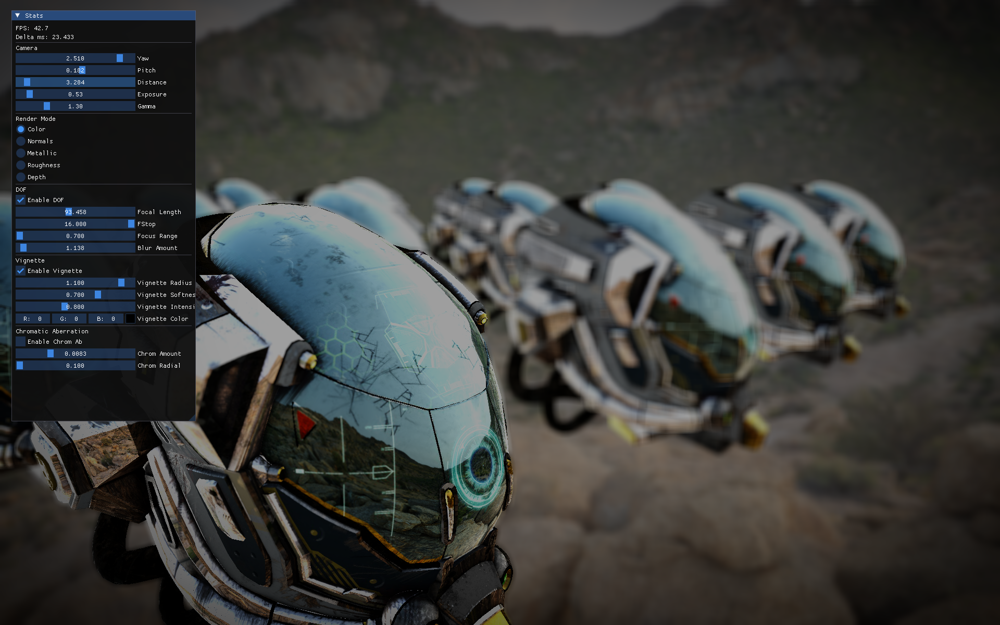
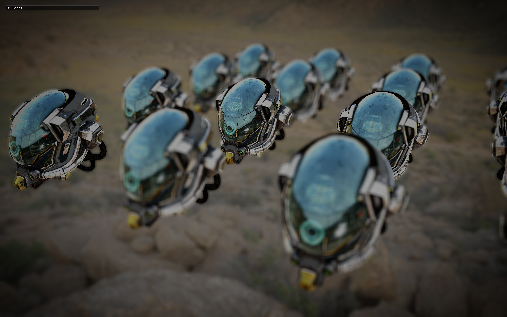
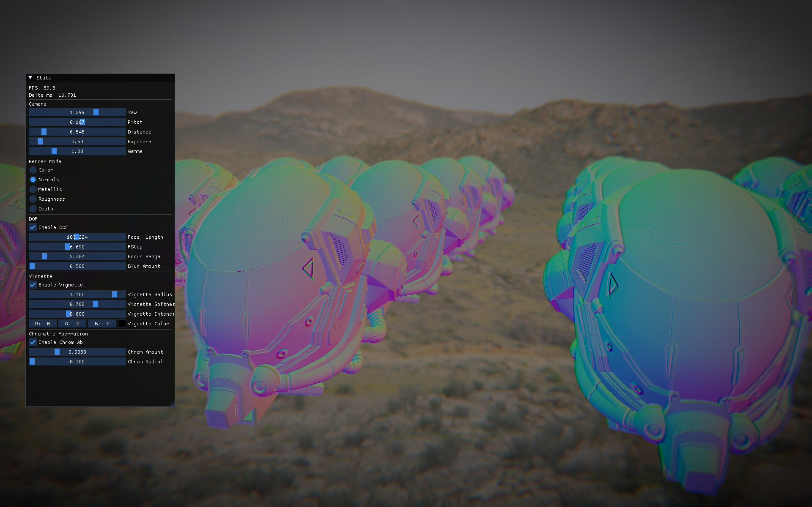
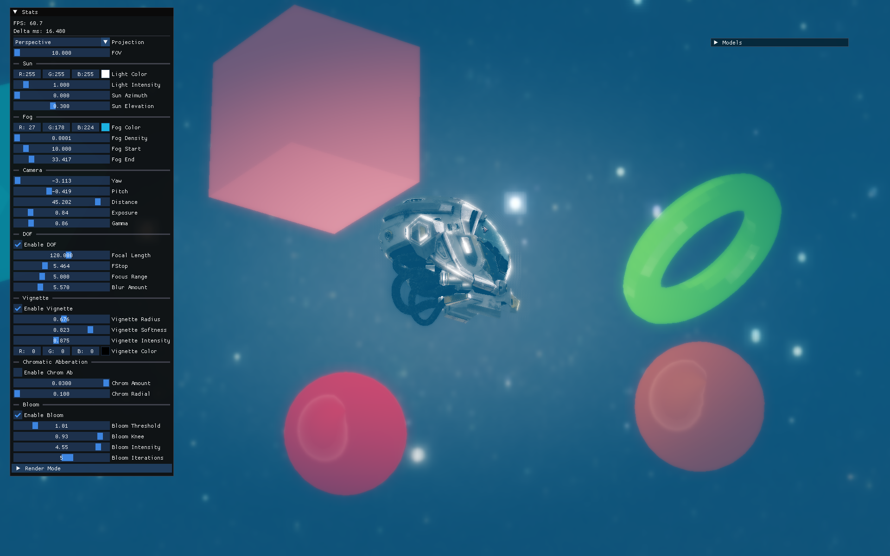

## OpenGL Samples / Experimental Renderer

Educational and experimental playground for modern OpenGL rendering. This project is used to explore real‑time rendering techniques, engine architecture patterns, and post‑processing pipelines while keeping the code relatively approachable.

### Screenshots

Below are sample captures (PNG).

|  |  |
|-----------------------------------------------|-----------------------------------------------|
|  |  |
|  |  |

### Key Features

* GLFW + GLAD core profile setup (C++23, CMake build)
* PBR style material sampling (albedo / normal / metallic-roughness / emissive / occlusion)
* glTF model loading (tinygltf) + fallback mesh generation
* Skybox / environment map sampling
* **HDR Bloom** with two-pass separable blur and downsample pipeline
* Depth of Field (toggleable) with circle of confusion based blur
* Filmic tone mapping + exposure + gamma control
* Vignette (radius / softness / intensity / color, invertable with minor shader tweak)
* Chromatic aberration (radial amount / falloff)
* **Compute shader support** for advanced post-processing effects
* ImGui (docking branch) integrated for live tweaking
* Gizmo (translate / rotate / scale modes)
* Text rendering via FreeType + msdfgen atlas (distance field fonts)
* Offscreen framebuffer -> full screen post process pass

### Controls (Default)

* Mouse Left Drag: Orbit camera
* Mouse Middle Drag: Pan
* Mouse Wheel / +/- : Zoom
* Q / W / E: Gizmo Translate / Rotate / Scale
* 1 / 2 / 3 / 4: Change debug render mode
* F11: Toggle fullscreen
* Ctrl + R: Hot reload shaders (PBR + screen)
* ESC: Quit

### Post Processing Parameters (ImGui Stats Window)

* **Bloom**: enable, threshold, intensity, blur passes
* DOF: enable + focal length, f-stop, focus range, max blur
* Exposure & Gamma
* Vignette: enable, radius, softness, intensity, color
* Chromatic Aberration: enable, amount, radial falloff

### Building

Standard CMake flow:

```bash
git clone --recursive <repo-url>
cd OpenGL_Samples
cmake -S . -B build -DCMAKE_BUILD_TYPE=Debug
cmake --build build --config Debug
```

If you added the repo without submodules initially:

```bash
git submodule update --init --recursive
```

### Folder Structure (High Level)

* `src/Core/` Core application systems (Camera, Buffer management, Main entry point)
* `src/Renderer/` Rendering systems (Bloom, Shaders, Textures, Framebuffers, Mesh handling)
* `src/Scene/` Scene graph and model loading
* `src/Math/` Mathematical utilities and helpers
* `resources/models/` Test glTF assets
* `resources/shaders/` GLSL shaders (PBR, bloom, post-effects, compute shaders)
* `resources/fonts/` TrueType font(s)
* `resources/hdr/` Environment maps
* `resources/screenshots/` Captured frames
* `thirdparty/` External libs (glfw, glad, glm, stb, tinygltf, freetype, msdfgen, imgui docking)


### Educational Goals

This codebase is intended for:

* Rapid prototyping of rendering ideas
* Learning GPU pipeline stages hands‑on
* Experimenting with post‑processing & camera effects
* Practicing modern C++ + RAII + lightweight renderer abstraction

### Possible Next Experiments

* ~~HDR bloom (two‑pass separable blur)~~ ✅ **Implemented**
* SSAO / GTAO
* BRDF LUT pre-integration for specular IBL
* GPU profiler zones & frame graphs
* Batch renderer or bindless resource experimentation
* Advanced compute shader effects
* Temporal Anti-Aliasing (TAA)
* Screen Space Reflections (SSR)

### License

Educational use. Third‑party libraries retain their original licenses.

---

Feel free to tweak and extend—this is a sandbox. Contributions and forks for additional learning features are welcome.
