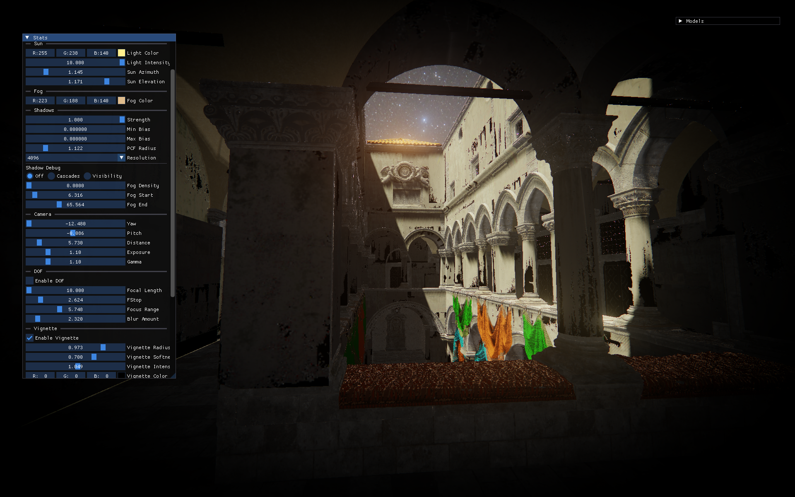
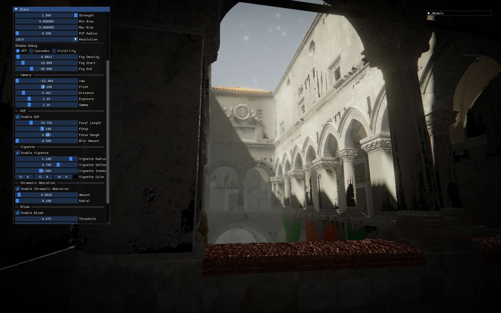
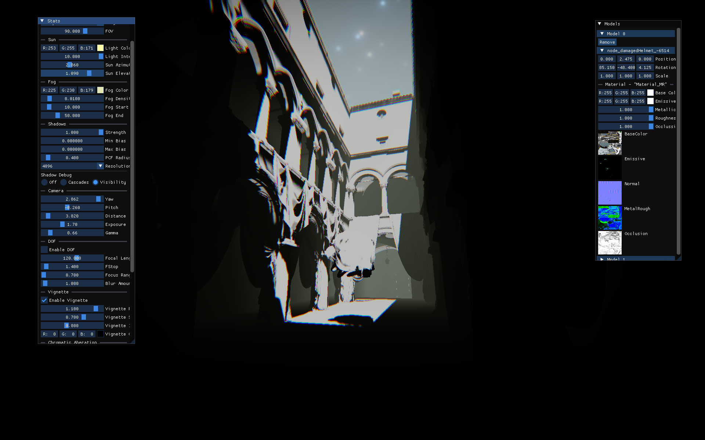
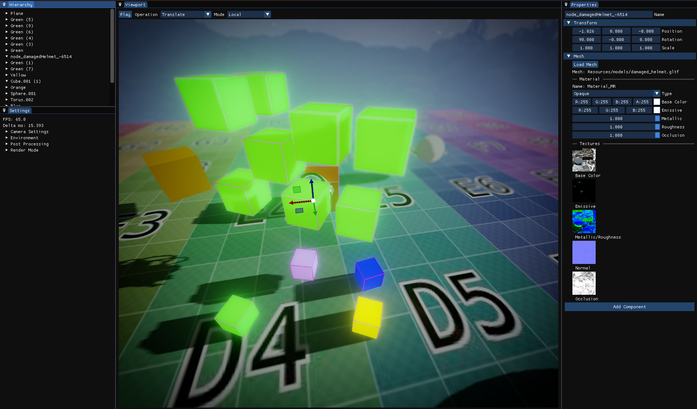

# Flex Engine

An educational game engine written in **C++23** for learning modern graphics programming, real-time rendering, and game engine architecture. Built on **OpenGL 4.6**, Flex Engine provides a clean, approachable codebase to experiment with physically-based rendering, post-processing effects, physics simulation, and scene management.

## Screenshots

Below are sample captures (PNG).

|  |  |
|-----------------------------------------------|-----------------------------------------------|
|  |  |
|  |  |

## Key Features

### Rendering
* **Physically-Based Rendering (PBR)**: Metallic-roughness workflow with albedo, normal, emissive, occlusion textures
* **Cascaded Shadow Maps**: 4-cascade directional shadows with PCF filtering
* **HDR Bloom**: Multi-level downsample/blur/upsample pipeline with soft knee threshold
* **Screen-Space Ambient Occlusion (SSAO)**: Depth-based AO with configurable radius/bias
* **Depth of Field**: Lens simulation with focal distance, f-stop, and bokeh blur
* **Post-Processing**: Vignette, chromatic aberration, tone mapping, exposure, gamma correction
* **Environment Mapping**: HDR skybox rendering with environment lighting
* **glTF 2.0 Support**: Full scene graph loading with materials, textures, and hierarchy

### Engine
* **Entity-Component-System**: EnTT for high-performance scene management
* **Jolt Physics Integration**: Rigid body dynamics with box/sphere colliders
* **Scene Serialization**: JSON-based save/load with stable entity UUIDs
* **Play/Stop Mode**: Runtime simulation with editor state restoration
* **ImGui Editor**: Docking layout with viewport, hierarchy, properties, statistics
* **Hot-Reload**: Shader recompilation at runtime (Ctrl+R)
* **MSDF Text Rendering**: Sharp text at any scale via multi-channel signed distance fields
* **Transform Gizmos**: ImGuizmo integration for translate/rotate/scale in viewport

### Platform
* **SDL3 Windowing**: Cross-platform window management and input
* **OpenGL 4.6 Core**: Modern rendering API with DSA (Direct State Access)
* **C++23**: Modern language features for clean, maintainable code

### Controls (Default)

* Mouse Right Drag: Orbit camera
* Mouse Middle Drag: Pan
* Mouse Wheel / +/- : Zoom

## Building

### Prerequisites

**Windows**
- Visual Studio 2022 or later (C++23 support required)
- CMake 3.21 or later
- Git (for submodule management)

**Linux**
- GCC 13+ or Clang 16+ (C++23 support)
- CMake 3.21+
- OpenGL development libraries:
  ```bash
  sudo apt-get install mesa-common-dev libgl1-mesa-dev libxinerama-dev \
                       libxcursor-dev libxi-dev libxrandr-dev
  ```

### Clone Repository

```bash
git clone --recursive https://github.com/yourusername/Flex.git
cd Flex
```

**If you forgot `--recursive`:**
```bash
git submodule update --init --recursive
```

### Configure and Build

**Windows (Visual Studio):**
```powershell
cmake -S . -B build -G "Visual Studio 17 2022" -A x64
cmake --build build --config Debug
```

**Windows (Ninja - faster builds):**
```powershell
cmake -S . -B build -G Ninja -DCMAKE_BUILD_TYPE=Debug
cmake --build build
```

**Linux:**
```bash
cmake -S . -B build -DCMAKE_BUILD_TYPE=Debug
cmake --build build -j$(nproc)
```

### Run

**Windows:**
```powershell
.\build\Flex\Debug\FlexEngine.exe
```

**Linux:**
```bash
./build/Flex/FlexEngine
```

### Build Configurations

- **Debug**: Full debug symbols, assertions enabled, slower performance
- **Release**: Optimizations enabled, no debug symbols, faster performance

Switch configuration by changing `-DCMAKE_BUILD_TYPE=Release` or building with `--config Release`.

## Project Structure

```
Flex/
├── CMakeLists.txt              # Root build configuration
├── readme.md                   # This file
├── Documentation.md            # Detailed engine documentation
├── Flex/                       # Main engine project
│   ├── CMakeLists.txt
│   ├── Source/
│   │   ├── Core/              # App, Window, Camera, ImGuiContext
│   │   ├── Renderer/          # Rendering systems (Shader, Mesh, Material, Bloom, SSAO, Shadows)
│   │   ├── Scene/             # ECS, Components, Serialization
│   │   ├── Physics/           # Jolt Physics integration
│   │   └── Math/              # Math utilities and helpers
│   └── Resources/
│       ├── shaders/           # GLSL vertex/fragment/compute shaders
│       ├── models/            # glTF test assets
│       ├── textures/          # Test textures and PBR maps
│       ├── hdr/               # HDR environment maps
│       ├── fonts/             # TrueType fonts for text rendering
│       └── screenshots/       # Captured frames
├── Tests/                     # Unit tests (Google Test)
│   ├── CMakeLists.txt
│   └── Source/
└── thirdparty/                # Third-party dependencies (as submodules)
    ├── sdl3/                  # SDL3 windowing library
    ├── glad/                  # OpenGL loader
    ├── glm/                   # Math library
    ├── imgui/                 # ImGui UI library
    ├── imguizmo/              # Transform gizmos
    ├── entt/                  # Entity-component-system
    ├── tinygltf/              # glTF loader
    ├── stb/                   # Image loading (stb_image)
    ├── freetype/              # Font rasterization
    ├── msdfgen/               # Multi-channel SDF generation
    ├── msdfatlasgen/          # SDF atlas generation
    ├── jolt/                  # Jolt Physics engine
    ├── json/                  # nlohmann/json
    └── googletest/            # Google Test framework
```


## Learning Objectives

This engine is designed as an educational resource for:

* **Graphics Programming**: Understand modern OpenGL, PBR lighting, shadow mapping, post-processing
* **Engine Architecture**: Learn subsystem design, scene graphs, ECS patterns, serialization
* **Physics Integration**: Connect rigid body simulation to transform systems
* **Tool Development**: Build editor UI with ImGui, implement gizmos and inspectors
* **Asset Pipeline**: Load glTF models, manage textures, generate font atlases
* **C++23 Practices**: Smart pointers, RAII, move semantics, template metaprogramming

## Future Experiments

**Completed ✅**
- HDR Bloom with multi-level blur
- Screen-Space Ambient Occlusion (SSAO)
- Cascaded Shadow Maps
- Jolt Physics Integration
- Scene Serialization

**Planned 🔧**
- Temporal Anti-Aliasing (TAA)
- Screen-Space Reflections (SSR)
- BRDF LUT for specular IBL
- GPU particle systems
- Deferred rendering pipeline
- Compute shader-based culling
- Animation system (skeletal/morph targets)
- Audio integration (OpenAL/FMOD)

## Contributing

This is an educational project. Feel free to:
- Fork and experiment with your own rendering techniques
- Submit pull requests for bug fixes or new features
- Open issues for questions or discussions
- Use as a learning resource or starting point for your own engine

## License

This project is for educational purposes. Check individual third-party library licenses in their respective directories under `thirdparty/`.

## Resources

- **Documentation**: See `Documentation.md` for in-depth class and system descriptions
- **LearnOpenGL**: https://learnopengl.com/ (excellent PBR and post-processing tutorials)
- **Jolt Physics**: https://jrouwe.github.io/JoltPhysics/ (physics engine docs)
- **glTF Spec**: https://registry.khronos.org/glTF/specs/2.0/glTF-2.0.html
- **EnTT**: https://github.com/skypjack/entt (ECS documentation)

---

**Happy Learning! 🚀**
